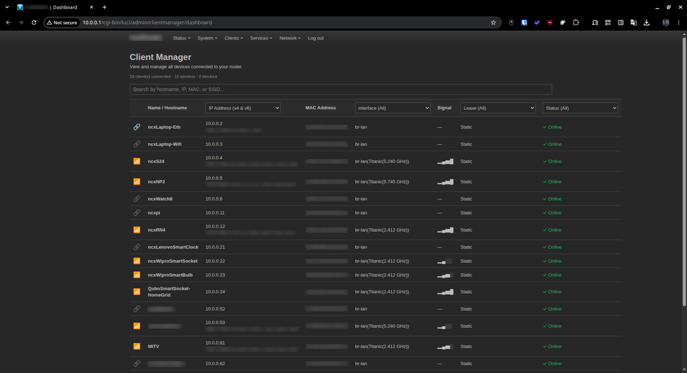
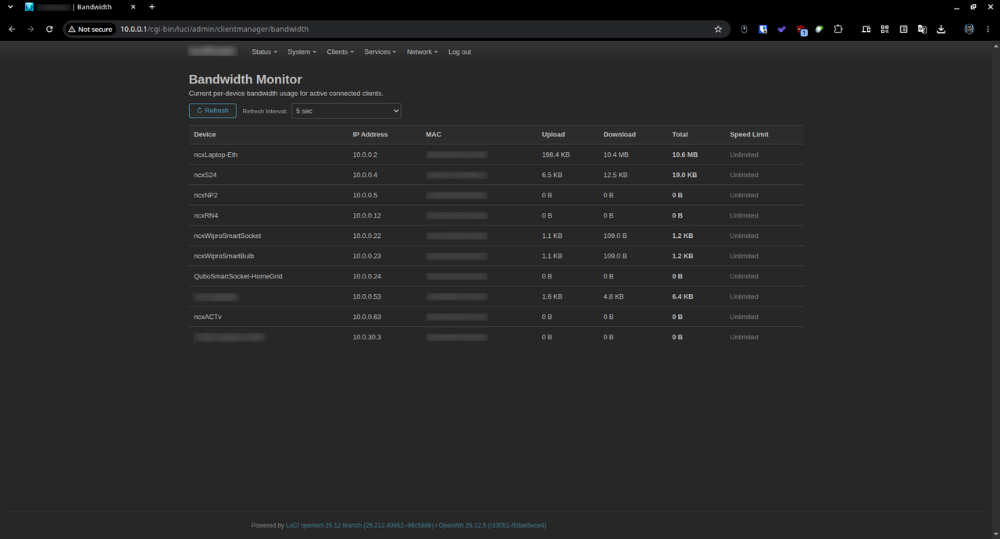
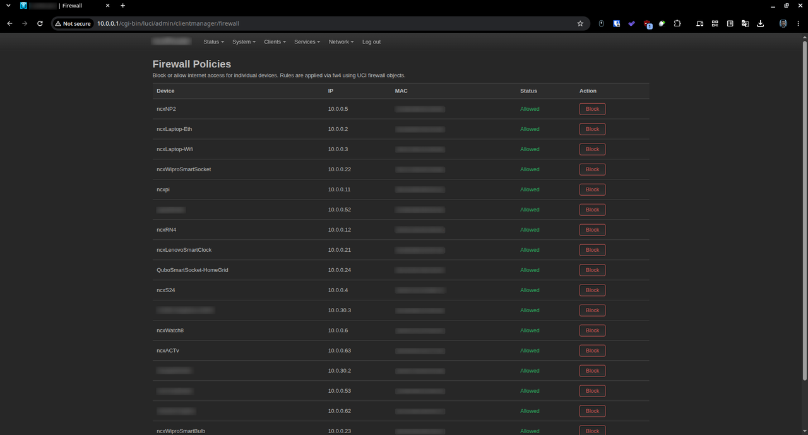
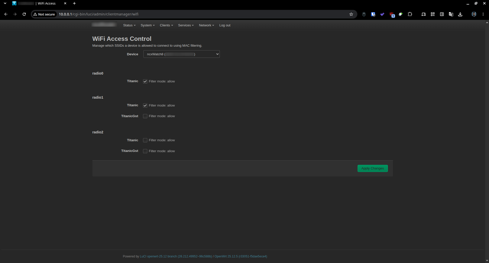

# luci-app-client-manager

[](https://openwrt.org)
[](https://www.gnu.org/software/bash/)
[](LICENSE)

`luci-app-client-manager` is a lightweight, daemonless LuCI application for OpenWrt routers to discover, identify, monitor, and manage devices on your local network. It aggregates telemetry from DHCP leases, ARP entries, IPv6 neighbor tables, and wireless association lists to present a fast, responsive, theme-native device management suite.

---

## Screenshots

### 📊 Client Dashboard


---

### ⚡ Bandwidth Monitor & Speed Limiter


---

### 🛡️ Firewall Internet Access Control


---

### 📶 WiFi Access Control


---

## Key Features

- **Device Dashboard**: Consolidates DHCP leases (`/tmp/dhcp.leases`), ARP table (`/proc/net/arp`), neighbor table (`ip neighbor`), and wireless associations into a unified device list.
- **Dual-Stack IPv4 & IPv6**: Automatically discovers and displays both IPv4 and IPv6 addresses per device.
- **Normalized Telemetry**: Displays interface and wireless telemetry as `InterfaceName(SSID(Frequency))` (e.g., `br-lan(SSID1(5.745 GHz))`).
- **Dynamic Filtering & Sorting**:
  - Filter by IP type (IPv4 / IPv6 / Both).
  - Filter by Interface (Wired / Wireless / Specific local network bridges like `br-lan`, `br-guest`).
  - Filter by Lease type (Static / Dynamic).
  - Filter by Status (Online / Blocked).
  - Prioritizes connected devices, sorted numerically by IP address (`ipToLong`).
- **Bandwidth Speed Limiter**: Custom download/upload rate limits with selectable unit options (**Mbps**, **MBps**, **Kbps**, **KBps**). Includes low-memory hardware performance warnings with bypass support for resource-constrained routers (<128MB RAM).
- **WiFi Access Control**: Manage per-SSID MAC filtering (`macfilter`) for connected clients or by entering any **Custom MAC Address**.
- **Firewall Internet Control**: Easily block or unblock internet access per device using OpenWrt `fw4` firewall rule injection.
- **Real-Time Bandwidth Monitoring**: Track active upload and download byte counters per device using `conntrack` with customizable refresh intervals (1s, 5s, 10s).
- **Native LuCI Theme Integration**: Clean, auto-adapting CSS dropdowns matching all standard LuCI light and dark themes (Argon, Bootstrap, Material, Design).

---

## Installation

### Method 1: SSH One-Liner (Recommended)

Connect to your OpenWrt router via SSH and run:

```bash
wget -qO- https://raw.githubusercontent.com/nightcodex7/luci-app-client-manager/main/install.sh | sh
```

*(Or using curl)*:

```bash
curl -sL https://raw.githubusercontent.com/nightcodex7/luci-app-client-manager/main/install.sh | sh
```

> The script automatically detects whether your system uses `apk` (OpenWrt 25.12+) or `opkg` (OpenWrt 24.10 and earlier) and handles dependencies accordingly.

---

### Method 2: OpenWrt SDK / ImageBuilder Build

To include the package in a custom firmware build:

```bash
# Clone into SDK package directory
git clone https://github.com/nightcodex7/luci-app-client-manager.git package/luci-app-client-manager

# Select in menuconfig
make menuconfig
# LuCI -> 3. Applications -> luci-app-client-manager

# Compile package
make package/luci-app-client-manager/compile
```

---

## Uninstallation

To remove the application and clear LuCI caches:

```bash
wget -qO- https://raw.githubusercontent.com/nightcodex7/luci-app-client-manager/main/uninstall.sh | sh
```

---

## Architecture

| Component | Technology | Role |
| --- | --- | --- |
| **Frontend** | Vanilla JS (ES6) | Client-side views (`/www/luci-static/resources/view/clientmanager/`) |
| **Backend** | POSIX Shell | `/usr/libexec/rpcd/luci.clientmanager` (RPC provider for `rpcd`) |
| **ACL Security** | `rpcd` ACL | Access control rules (`/usr/share/rpcd/acl.d/luci-app-client-manager.json`) |
| **Menu Registration** | LuCI Menu JSON | Navigation entry (`/usr/share/luci/menu.d/luci-app-client-manager.json`) |
| **Data Sources** | System Utilities | `ubus` (`iwinfo`, `hostapd`), `iw`, `/proc/net/arp`, `ip neighbor`, `/tmp/dhcp.leases`, `conntrack` |

---

## Compatibility

- **OpenWrt Versions**: OpenWrt 21.02, 22.03, 23.05, 24.10, 25.12+ (and derivative firmwares like ImmortalWrt).
- **Package Managers**: Works with both `opkg` and `apk`.
- **Architectures**: All architectures (`LUCI_PKGARCH:=all`).
- **Dependencies**: `luci-base`, `rpcd`, `rpcd-mod-luci`, `conntrack`.

---

## Project Structure

```text
luci-app-client-manager/
├── LICENSE
├── Makefile
├── README.md
├── install.sh
├── uninstall.sh
├── assets/
│   ├── bandwidth.png
│   ├── dashboard.png
│   ├── firewall.png
│   └── wifiaccess.png
├── root/
│   ├── etc/
│   │   └── uci-defaults/
│   │       └── luci-app-client-manager
│   └── usr/
│       ├── libexec/
│       │   └── rpcd/
│       │       └── luci.clientmanager
│       └── share/
│           ├── luci/
│           │   └── menu.d/
│           │       └── luci-app-client-manager.json
│           └── rpcd/
│               └── acl.d/
│                   └── luci-app-client-manager.json
└── htdocs/
    └── luci-static/
        └── resources/
            └── view/
                └── clientmanager/
                    ├── bandwidth.js
                    ├── dashboard.js
                    ├── details.js
                    ├── firewall.js
                    └── wifi.js
```

---

## License

This project is licensed under the **Apache License 2.0**.
Copyright (c) 2026 Tuhin Garai <tuhingarai123@gmail.com>
